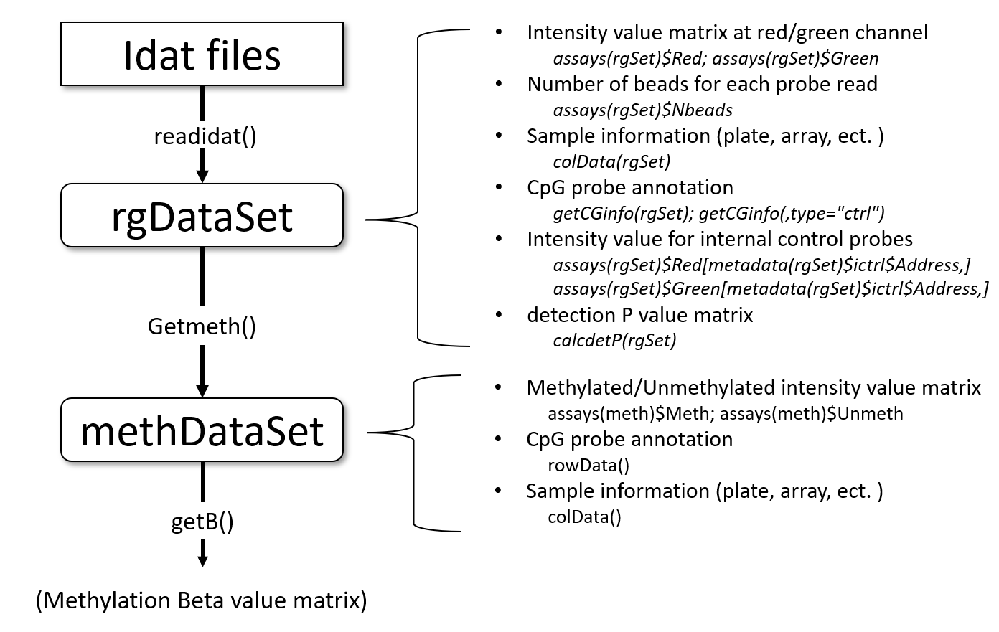
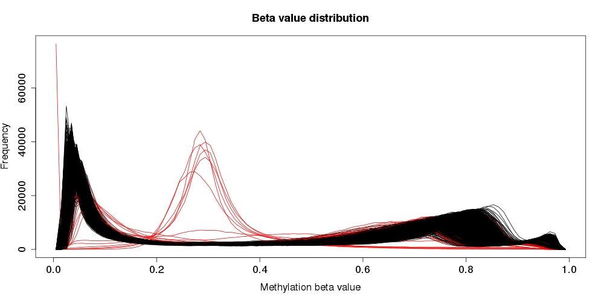
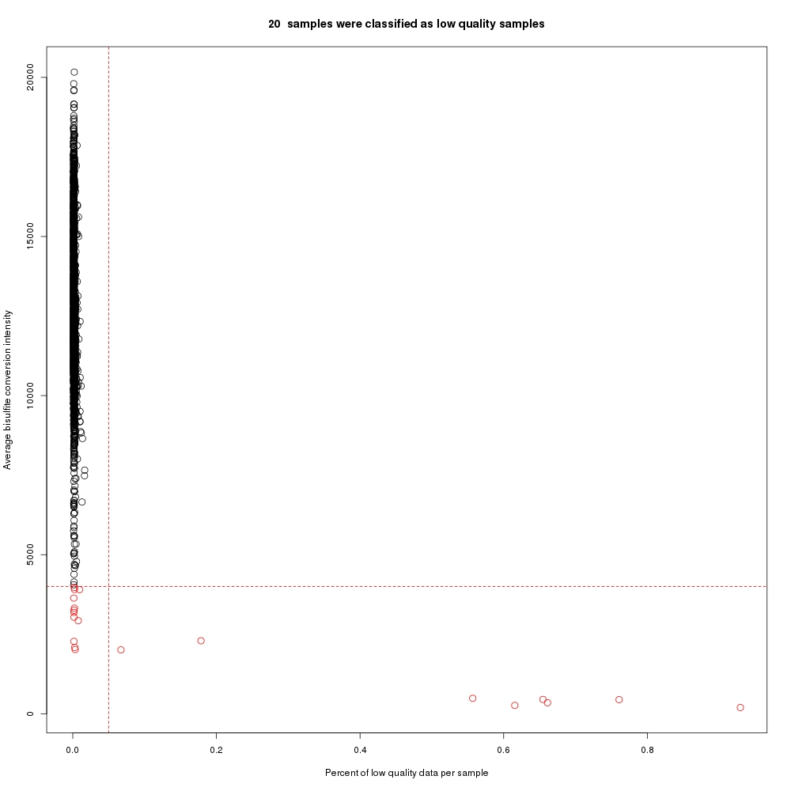
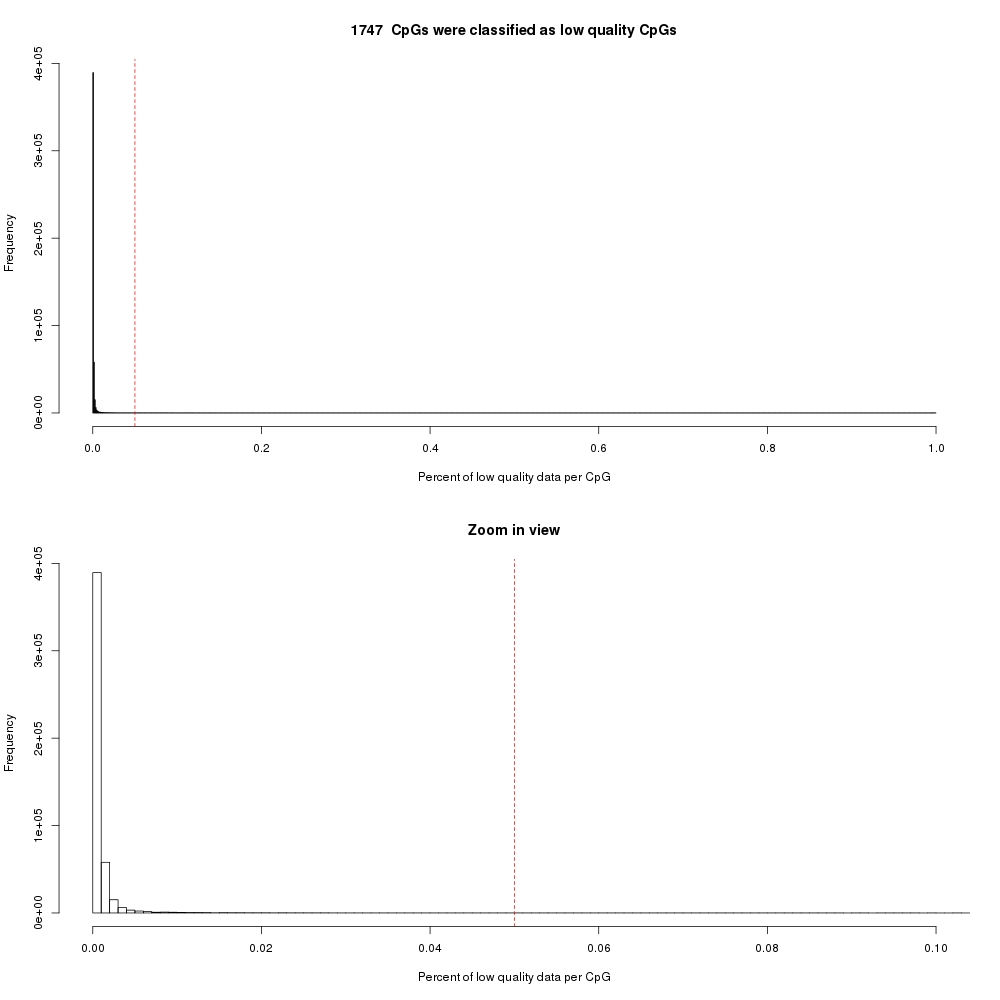

# Introduction

The `r Biocpkg("ENmix")` package provides a set of quality control,
preprocessing/correction and data analysis tools for Illumina Methylation Beadchips. 
It includes functions to read in raw idat data, 
background correction, dye bias correction, probe-type bias adjustment, 
 along with a number of additional tools.
These functions can be used to remove unwanted experimental noise and thus to
improve accuracy and reproducibility of methylation measures. 
`r Biocpkg("ENmix")` functions 
are flexible and transparent. Users have option to choose a single pipeline 
command to finish all data pre-processing steps (including quality control, 
background correction, 
dye-bias adjustment, between-array normalization and probe-type bias correction) or 
to use individual functions sequentially to perform data pre-processing in a more 
customized manner. In addition the `r Biocpkg("ENmix")` package has selectable 
complementary functions for efficient data visualization (such as QC plots, data 
distribution plot, manhattan plot and Q-Q plot), quality control (identifing and filtering 
low quality data points, samples, probes, and outliers, along with 
imputation of missing values), identification of probes with multimodal 
distributions due to SNPs or other factors, exploration of data variance
 structure using principal component regression analysis plot, preparation
of experimental factors related surrogate control variables 
to be adjusted in downstream 
statistical analysis, an efficient algorithm oxBS-MLE to estimate
5-methylcytosine and 5-hydroxymethylcytosine level; estimation of celltype
proporitons; methlation age calculation and differentially methylated
region (DMR) analysis.

Most `r Biocpkg("ENmix")` package can also support the data structure used by 
several other related R packages, such as `r Biocpkg("minfi")`,
`r Biocpkg("wateRmelon")` and `r Biocpkg("ChAMP")`,
providing straightforward integration of 
ENmix-corrected datasets for subsequent data analysis. 

`r Biocpkg("ENmix")` readidat function does not depend on array annotation R packages.
It can directly read in Illuminal manifest file, which makes it easier to work with
newer array, such as MethylationEPICv2.0 and  mouse Beadchip.

The software is designed to support large scale data analysis, and provides
 multi-processor parallel computing options for most functions. 


# List of functions

<b>Data acquisition</b>

<ul>
<li>`readidat()`:  Read idat files into R</li>
<li>`readmanifest()`:  Read array manifest file into R</li>
</ul>

<b>Quality control</b>

<ul>
<li>`QCinfo()`:      Extract and visualize QC information</li>
<li>`plotCtrl()`:    Generate internal control plots</li>
<li>`getCGinfo()`:   Extract CpG probe annotation information</li>
<li>`calcdetP()`:    Compute detection P values</li>
<li>`qcfilter()`:  Remove low quality values, samples or CpGs; remove outlier samples and perform imputation</li>
<li>`nmode()`:   Identify "gap" probes, i.e. those with multimodal distribution from underlying caused by underlying SNPs</li>
<li>`dupicc()`:     Calculate Introclass correlation coefficient (ICC) using data for duplicates</li>
<li>`freqpoly()`:  Frequency polygon plot for single variable</li>
<li>`multifreqpoly()`:  Frequency polygon plot for multiple variables</li>
</ul>

<b>Preprocessing</b>

<ul>
<li>`mpreprocess()`:      Preprocessing pipeline</li>
<li>`preprocessENmix()`:  ENmix background correction and dye bias correction</li>
<li>`relic()`:            RELIC dye bias correction</li>
<li>`norm.quantile()`:    Quantile normalization</li>
<li>`rcp()`:              RCP probe design type bias correction</li>
</ul>

<b>Differential methylated region (DMR) analysis</b>

<ul>
<li>`ipdmr()`:    ipDMR differentially methylated region analysis</li>
<li>`combp()`:    Combp differentially methylated region analysis</li>
</ul>

<b>Other functions</b>

<ul>
<li>`oxBS.MLE()`:  MLE estimates of 5-methylcytosine (5mC) and 5-hydroxymethylcytosine (5hmC)</li>
<li>`estimateCellProp()`:    Estimate white blood cell type proportions</li>
<li>`methyAge()`:     Calculate methylation age</li>
<li>`predSex()`:      Estimate sample sex</li>
<li>`ctrlsva()`:      Derive surrogate variables to control for experimental confounding using non-negative internal control probes</li>
<li>`pcrplot()`:      Principal component regression plot </li>
<li>`mhtplot()`:      P value manhattan plot </li>
<li>`p.qqplot()`:    P value Q-Q plot  </li>
<li>`B2M()`:          Convert Beta value to M value </li>
<li>`M2B()`:          Convert M value to Beta value  </li>
</ul>

# ENmix classes

ENmix organizes data with two different classes.

`rgDataSet` contains raw data (including internal control probes) from IDAT file, CpG annotation from Illumina manifest file and/or sample inforamtion (plate, array, and phenotypes) provided by users. Array intensity data is organized by probe (not CpG locus) at red and green channel.  

`methDataSet` contains methylated and unmethylated intensity values (organized by CpG), CpG annotation from Illumina manifest file and/or sample inforamtion (plate, array, and phenotypes) provided by users.




# Example Analysis

The following examples are brief demonstrations on how to perform DNA methylation analysis using ENmix functions.


## Example 1: using pipeline

The pipeline function `mpreprocess()` can be used to perform quality 
control and data preprocessing.

```{r pipeline, eval=FALSE}
rgSet <- readidat(datapath)
beta=mpreprocess(rgSet)
```
These can achieve the following tasks:

<ul>
  <li>Read in raw idat files</li>
  <li>Data preprocessing</li>
    <ul>
      <li>background correction</li>
      <li>dye-bias correction</li>
      <li>between-array normalization</li>
      <li>probe-type bias adjustment</li>
    </ul>
  <li>Quality control</li>
    <ul>
      <li> Identify and exclude low quality probes</li>
      <li> Identify and exclude low quality samples</li>
      <li> Identify and exclude outlier samples</li>
      <li> Remove low quality and outlier data points</li>
      <li> Imputation to replace missing values</li>
    </ul>
  <li>Visualization</li>
    <ul>
      <li>Data distribution plots before and after low quality sample removal</li>
      <li>Plots of quality controls measures (detection P values, bisulfite control intensities) to guide selection of thresholds</li>
    </ul>
</ul>

The following is an executable example.

```{r example1, eval=FALSE}
library(ENmix)
#read in data
require(minfiData)
#read in IDAT files
path <- file.path(find.package("minfiData"),"extdata")
rgSet <- readidat(path = path,recursive = TRUE)
#data pre-processing
beta=mpreprocess(rgSet,nCores=6)
#quality control, data pre-processing and imputation
beta=mpreprocess(rgSet,nCores=6,qc=TRUE,fqcfilter=TRUE,
     rmcr=TRUE,impute=TRUE)

#CpG information (from Illumina manifest file) is self-contained in rgDataSet or methDataSet
cginfo=getCGinfo(rgSet)
#It has the same infomation if extracted from methDataSet
meth=getmeth(rgSet)
cginfo1=rowData(meth)
#Probe information for internal controls
ictrl=getCGinfo(rgSet,type="ctrl")
```

## Example 2: using individual function

The example code below is basically doing the same thing as in example 1, but 
has more customized options. 

```{r example2, eval=FALSE}
library(ENmix)
#read in data
path <- file.path(find.package("minfiData"),"extdata")
rgSet <- readidat(path = path,recursive = TRUE)
#QC info
qc<-QCinfo(rgSet)
#background correction and dye bias correction
#if qc info object is provided, the low quality or outlier samples
# and probes will be excluded before background correction
mdat<-preprocessENmix(rgSet, bgParaEst="oob", dyeCorr="RELIC", 
                     QCinfo=qc, nCores=6)
#between-array normalization
mdat<-norm.quantile(mdat, method="quantile1")
#probe-type bias adjustment
beta<-rcp(mdat,qcscore=qc)
#set low quality and outlier data points as NA (missing value)
#remove samples and probes with too many (eg. >5%) missing data
#perform imputation to replace missing values
beta <- qcfilter(beta,qcscore=qc,rmcr=TRUE,impute=TRUE)
```

## Example 3: A more comprehensive example

This example is a brief demonstration of major functions in `r Biocpkg("ENmix")`. 
Getting detailed information about data quality, SNP-like/gap probes, excluding 
user-specified probes and/or samples, principal component regression analysis,
low quality or outlier sample or probe removal, sex prediction, 
cell type proportion estimation, methylation age estimation, differentially 
methylated region analysis and surrogate variables for batch effect, etc. 

```{r example3, eval=FALSE}
library(ENmix)
#read in data
path <- file.path(find.package("minfiData"),"extdata")
rgSet <- readidat(path = path,recursive = TRUE)

#attach some phenotype info for later use
sheet <- read.metharray.sheet(file.path(find.package("minfiData"),
         "extdata"),pattern = "csv$")
rownames(sheet)=paste(sheet$Slide,sheet$Array,sep="_")
colData(rgSet)=as(sheet[colnames(rgSet),],"DataFrame")

#generate internal control plots to inspect quality of experiments
plotCtrl(rgSet)

#generate quality control (QC) information and plots, 
#identify outlier samples in data distribution
#if set detPtype="negative", recommend to set depPthre to <= 10E-6
#if set detPtype="oob", depPthre of 0.01 or 0.05 may be sufficient
#see Heiss et al. PMID: 30678737 for details
qc<-QCinfo(rgSet,detPtype="negative",detPthre=0.000001)

###data preprocessing
#background correction and dye bias correction
mdat<-preprocessENmix(rgSet, bgParaEst="oob", dyeCorr="RELIC",
                      QCinfo=qc, nCores=6)
#between-array normalization
mdat<-norm.quantile(mdat, method="quantile1")
#attach phenotype data for later use
colData(mdat)=as(sheet[colnames(mdat),],"DataFrame")
#probe-type bias adjustment
beta<-rcp(mdat,qcscore=qc)

#Search for multimodal CpGs, so called gap probes
#beta matrix before qcfilter() step should be used for this purpose
nmode<-nmode(beta, minN = 3, modedist=0.2, nCores = 6)

#filter low quality and outlier data points for each probe
#rows and columns with too many missing values will be removed if specify
#Imputation will be performed to fill missing data if specify.
beta <- qcfilter(beta,qcscore=qc,rmcr=TRUE, rthre=0.05,
                   cthre=0.05,impute=TRUE)

#If for epigenetic mutation analysis, outliers should be kept 
beta <- qcfilter(beta,qcscore=qc,rmoutlier=FALSE,rmcr=TRUE, rthre=0.05,
#                   cthre=0.05,impute=FALSE)

##Principal component regression analysis plot to check data variance structure
#phenotypes to be studied in the plot
cov<-data.frame(group=colData(mdat)$Sample_Group,
    slide=factor(colData(mdat)$Slide))
#missing data is not allowed in the analysis!
pcrplot(beta, cov, npc=6)

#Non-negative control surrogate variables, which can be used in
# downstream association analysis to control for batch effects. 
csva<-ctrlsva(rgSet)

#estimate cell type proportions
#rgDataset or methDataSet can also be used for the estimation
celltype=estimateCellProp(userdata=beta,
         refdata="FlowSorted.Blood.450k",
         nonnegative = TRUE,normalize=TRUE)

#predic sex based on rgDataSet or methDataset
sex=predSex(rgSet)
sex=predSex(mdat)

#Methylation age calculation
mage=methyAge(beta)

#ICC analysis can be performed to study measurement reliability if
# have duplicates, see manual
#dupicc()

#After association analysis, the P values can be used for DMR analysis
#simulate a small example file in BED format
dat=simubed()
#using ipdmr method, low seed value (0.01 or 0.05) should be used in real study.
ipdmr(data=dat,seed=0.1)
#using comb-p method
combp(data=dat,seed=0.1)
```

# Setting up the data

The first step is to import array raw data files (*.idat)
 to create an object of `rgDataSet`, which is similar to 
`RGChannelSetExtended` in minfi package, but with probe annotation 
integrated, and it has smaller data size (about 1/3 smaller). Alternatively, User can also 
use minfi package to read in idat files and create 
`RGChannelSetExtended`. Most functions in ENmix support 
`RGChannelSetExtended` and `RGChannelSet`.

Some array types and corresponding manifestfiles can be guessed by the program based on
the number of probes per array. However, we recommend users provide the correct manifest file (.csv format)
directly for their types of array, which can be easily downloaded from Illumina website, see below for some examples.
This option also allows the function to read in data from newer array, such as mouse array. 

```{r readdata, eval=FALSE}
library(ENmix)
rgSet <- readidat(path = "directory path for idat files", 
                 recursive = TRUE)

#Download manifestfile for HumanMethylation450 beadchip
system("wget https://webdata.illumina.com/downloads/productfiles/humanmethylation450/humanmethylation450_15017482_v1-2.csv")
mf="HumanMethylation450_15017482_v1-2.csv"
rgSet <- readidat(path = "path to idat files",manifestfile=mf,recursive = TRUE)
```

When methylation IDAT raw data files are not available, such as for some
 publicly available datasets, users can use methylated (M) and unmethylated
 (U) intensity data to create an object of `MethylSet`. `MethylSet`
is also supported by most functions in ENmix.

```{r readdata2, eval=FALSE}
M<-matrix_for_methylated_intensity
U<-matrix_for_unmethylated_intensity
pheno<-as.data.frame(cbind(colnames(M), colnames(M)))
names(pheno)<-c("Basename","filenames")
rownames(pheno)<-pheno$Basename
pheno<-AnnotatedDataFrame(data=pheno)
anno<-c("IlluminaHumanMethylation450k", "ilmn12.hg19")
names(anno)<-c("array", "annotation")
mdat<-MethylSet(Meth = M, Unmeth = U, annotation=anno, 
phenoData=pheno)
```

# Quality Control
## Internal control probes

Both Illumina 450k and EPIC array incorporate 15 different types of internal control
probes (total of 848 probes for 450K and 635 probes for EPIC). The control 
plots from ENmix function `plotCtrl()` are similar to the control plots generated  
by Illumina GenomeStudio software. See Illumina Infinium HD Methylation Assay for 
detailed description on how to interpret these control figures. 

```{r ctrlplot, eval=FALSE}
plotCtrl(rgSet)
```
 
Below is a list of internal control types and number of probes for each type. 

<table style="width:70%">
<tr style="border-top:2pt solid black;">
<td><b>Control types</b></td><td><b>450K</b></td><td><b>EPIC v1</b></td><td><b>EPIC v2</b></td>
</tr>
<tr style="border-top:1pt solid black;"><td><b>Sample-Independent Controls</b></td></tr>
<tr>
<td>STAINING</td><td>4</td><td>6</td><td>4</td></tr>
<tr><td>EXTENSION </td><td> 4 </td><td> 4</td><td>4</td></tr>
<tr><td>HYBRIDIZATION</td><td> 3 </td><td> 3</td><td>3</td></tr>
<tr><td>TARGET REMOVAL</td><td> 2 </td><td> 2</td><td>2</td></tr>
<tr><td>RESTORATION </td><td> 1 </td><td> 1</td><td>1</td></tr>
<tr style="border-top:1pt solid black;">
<td><b>Sample-Dependent Controls</b></td></tr>
<tr><td>BISULFITE CONVERSION I </td><td> 12 </td><td> 10</td><td>10</td></tr>
<tr><td>BISULFITE CONVERSION II </td><td> 4 </td><td> 4</td><td>4</td></tr>
<tr><td>SPECIFICITY I </td><td> 12 </td><td> 12</td><td>12</td></tr>
<tr><td>SPECIFICITY II </td><td> 3 </td><td> 3</td><td>3</td></tr>
<tr><td>NON-POLYMORPHIC </td><td> 4 </td><td> 9</td><td>9</td></tr>
<tr><td>NORM_A </td><td> 32 </td><td> 27</td><td>27</td></tr>
<tr><td>NORM_C </td><td> 61 </td><td> 58</td><td>58</td></tr>
<tr><td>NORM_G </td><td> 32 </td><td> 27</td><td>27</td></tr>
<tr><td>NORM_T </td><td> 61 </td><td> 58</td><td>58</td></tr>
<tr style="border-bottom:2pt solid black;"><td>NEGATIVE </td><td> 613 </td><td> 411</td><td>411</td></tr>
</table>


These controls can be plotted in user specified order to check 
how experimental factors affect methylation measures, such as batch,
 plate, array or array location.

```{r ctrlplot2, eval=FALSE}

path <- file.path(find.package("minfiData"),"extdata")
rgSet <- readidat(path = path,recursive = TRUE)
sheet <- read.metharray.sheet(file.path(find.package("minfiData"),
         "extdata"), pattern = "csv$") 
rownames(sheet)=paste(sheet$Slide,sheet$Array,sep="_")
colData(rgSet)=as(sheet[colnames(rgSet),],"DataFrame")
#control plots
IDorder=rownames(colData(rgSet))[order(colData(rgSet)$Slide,
        colData(rgSet)$Array)]
plotCtrl(rgSet,IDorder)
```

## Data distribution plots

Methylation intensity or beta value distribution plots are 
very useful for data summary, visual inspection and identification of 
outlier samples. Density plots are routinely generated using R function
`multidensity()`. However, the function is computationally intensive,
 and can take several hours to produce density plots for a large methylation 
dataset. 

Frequency polygon plot is an alternative figure for inspection of data
distribution. Similar to histogram, it can accurately reflect data distribution and
easy to understand. The function is also much faster, and only takes a few
minutes to produce a distribution plot for >1000 samples. 

```{r distplot, eval=FALSE}

mraw <- getmeth(rgSet)
#total intensity plot is userful for data quality inspection
#and identification of outlier samples
multifreqpoly(assays(mraw)$Meth+assays(mraw)$Unmeth,
             xlab="Total intensity")
#Compare frequency polygon plot and density plot
beta<-getB(mraw)
anno=rowData(mraw)
beta1=beta[anno$Infinium_Design_Type=="I",]
beta2=beta[anno$Infinium_Design_Type=="II",]
library(geneplotter)
jpeg("dist.jpg",height=900,width=600)
par(mfrow=c(3,2))
multidensity(beta,main="Multidensity")
multifreqpoly(beta,main="Multifreqpoly",xlab="Beta value")
multidensity(beta1,main="Multidensity: Infinium I")
multifreqpoly(beta1,main="Multifreqpoly: Infinium I",
xlab="Beta value")
multidensity(beta2,main="Multidensity: Infinium II")
multifreqpoly(beta2,main="Multifreqpoly: Infinium II",
xlab="Beta value")
dev.off()
```

See the following figures generated from the above code. When 
type I and type II probes are plotted separately bottom 4 panels, 
the difference in modes between type I and II probes can be appreciated. 
But when all probes are plotted together (top panel), the
multidensity plot obscures these differences, while they remain readily 
apparent in the multifreqpoly plot. In addition, the multidensity plots 
appear to suggest that probes range in value
from <0 to >1, whereas multifreqpoly correctly show the range from 0 to 1.


## QC information, outlier samples, low quality samples and probes

Data quality measures, including detection P values, average intensities for 
bisulfite conversion probes and number of 
beads for each methylation read 
can be extracted or estimated using the 
function `QCinfo()` from an object of `rgDataSet` or
 `RGChannelSetExtended`. Based on default or user specified 
quality score thresholds, the `QCinfo()` will identify 
a list of low quality samples and CpG probes as wells as outlier samples based on 
total intensity or beta value distribution. These samples and probes
should be excluded before 
further analysis. Data quality score figures "qc_sample.jpg" and "qc_CpG.jpg" from
`QCinfo()` can be used to guide the selection of quality score 
thresholds. Low quality samples and probes 
are listed as "badsample" and "badCpG" in QCinfo object, and also marked 
in red in figure "freqpolygon\_beta\_beforeQC.jpg". 

```{r filter, eval=FALSE}
qc<-QCinfo(rgSet)
#QCinfo returns "detP","nbead","bisul","badsample","badCpG","outlier_sample"
#Samples with low quality data
qc$badsample
#CpGs with low quality data
qc$badCpG
#outlier samples
qc$outlier_sample

#Low quality samples and probes should be excluded before data preprocesssing 
#by specifying `QCinfo` in `preprocessENmix()`
mdat<-preprocessENmix(rgSet, QCinfo=qc, nCores=6)
```








## Filtering outliers, low quality data points, missing values and imputation

After excluding low quality samples and probes, as well as outlier samples.
we can still have many low quality and outlier data points for many CpGs.
These small percentage of data points can have big impact on downstream 
association statistical tests for individual CpGs. 
Function `qcfilter()` can be used to filter out these
data points and replace them with missing value NA. Outliers are defined as 
values smaller than 3 times IQR from the lower quartile or larger than 
3 times IQR from the upper quartile. Some statistical methods do not allow 
missing values,(e.g. principal component analysis), so 
 argument \textit{impute=TRUE} in the function can be 
specified to impute missing data using k-nearest neighbors method. 

```{r rmoutlier, eval=FALSE}
#filter outlier values only
b1=qcfilter(beta)
#filter low quality and outlier values
b2=qcfilter(beta,qcscore=qc)
#filter low quality and outlier values, remove rows 
#and columns with too many missing values
b3=qcfilter(beta,qcscore=qc,rmcr=TRUE)
#filter low quality and outlier values, remove rows and
#columns with too many (rthre=0.05,cthre=0.05, 5% in default) missing values,
# and then do imputation
b3=qcfilter(beta,qcscore=qc,rmcr=TRUE,rthre=0.05,
              cthre=0.05,impute=TRUE)
```

# Background correction and dye-bias correction

Function `preprocessENmix()` incorporates a model-based background
 correction method `ENmix`, which models methylation signal intensities 
with a flexible exponential-normal mixture distribution, together
 with a truncated normal distribution to model background noise. 
Argument "dyeCorr"
can be used to specify a method for dye-bias correction, the default is RELIC. 

Refer the following papers for the detailed description of related methods:

Zongli Xu, et. al. ENmix: a novel background correction method for Illumina
HumanMethylation450 BeadChip, Nucleic Acids Research, 2015

Xu Z, Langie SA, De Boever P, Taylor JA, Niu L.
RELIC: a novel dye-bias correction method for Illumina Methylation BeadChip.
BMC Genomics. 2017

If argument QCinfo is specified, the low quality samples and probes identified 
by function `QCinfo()` will be excluded before ENmix background correction.
Using argument `exSample` and `exCpG`, User can also specify a list 
of samples or probes to be excluded before background correction. 
 
```{r preprocessENmix, eval=FALSE}
qc=QCinfo(rgSet)
mdat<-preprocessENmix(rgSet, bgParaEst="oob", dyeCorr="RELIC", 
QCinfo=qc, exCpG=NULL, nCores=6)
```

# Inter-array normalization

Function `norm.quantile()` can be used to perform quantile 
normalization on methylation intensity values.

```{r normalize.quantile, eval=FALSE}
mdat<-norm.quantile(mdat, method="quantile1")
```

# Probe-type bias adjustment

The majority of probes on Illumina 450K and EPIC BeadChips are type II probes.
 Although type II probes facilitate increased array genome coverage, they were
 shown to have decreased dynamic range and reproducibility compared to type I
 probes. Taking advantage of the high spatial correlation of DNA methylation 
levels along the human genome, The RCP 
(Regression on Correlated Probes) method utilizes nearby (<25 bp) type I and 
II probe pairs to derive the quantitative relationship between probe types and
 then recalibrates type II probe measurements using type I probes as referents. 

```{r rcp, eval=FALSE}
beta<-rcp(mdat)
```

Refer the following publication for the detailed description of the method:

Niu L, Xu Z, Taylor JA.
RCP: a novel probe design bias correction method for Illumina Methylation
BeadChip. Bioinformatics, 2016

# Batch effect correction

Function `ctrlsva()` can be used to estimate surrogate variables for batch 
effects and unknown experimental confounders using intensity data for non-negative 
internal control probes. These surrogate variables can then be modeled as covariables in 
downstream association analysis to adjust for experimental variation.

```{r ctrlsva, eval=FALSE}
sva<-ctrlsva(rgSet)
```

# Principal component regression analysis plot

First, principal component analysis will be performed on the standardized beta value 
matrix (standardized probe by probe), and then the specified number of top 
principal components (that explain most data variation) will be used to perform
linear regression with each specified variables, such as batch or phenotype
variables. Regression P values will be 
plotted to explore methylation data variance structure and to identify possible
 confounding variables to guide association statistical analysis. Principal 
components are ordered according to the percentage of variance they explained 
from large to small. PCA will not allow for missing values, so specify impute=true 
in preprocessing (`qcfilter()`) if there is missing data.

```{r pcrplot, eval=FALSE}
require(minfiData)
mdat <- preprocessRaw(RGsetEx)
beta=getBeta(mdat, "Illumina")
group=pData(mdat)$Sample_Group
slide=factor(pData(mdat)$Slide)
cov=data.frame(group,slide)
pcrplot(beta,cov,npc=6)
```


# Multimodal CpGs or gap probes

Function `nmode()` uses an empirical approach to identify
CpGs whose methylation values are multimodal distributed 
(SNP-like or gap probes). When measured in a population of people
 the majority of CpGs on the Illumina HumanMethylation450 BeadChip have
 unimodal distributions of DNA methylation values with relatively small
 between-person variation. However, some CpGs may have multimodal
 distributions of methylation values with sizeable differences between
 modes and large between-person variation.

These multimodal distributed
data are usually caused by SNP effect in the probe region, 
problematic probe design or
other unknown artifacts rather than by actual difference in methylation 
level and thus
should be excluded from DNA methylation analysis. Researchers
 have often excluded CpGs based simply on SNP annotation information
(e.g. reported SNPs in or near probe sequences). However,
because SNP frequency and annotation always depends on population origin, we find
 that this approach alone may exclude many well-distributed (unimodal)
 CpGs, while still failing to identify other problematic multi-modal CpGs. We developed
 an empirical approach to identify CpGs that are obviously not uni-modally
 distributed,
 so that researchers can make more informed decisions about whether to
exclude them in their particular study populations and analyses.

See online supplementary materials of the following paper for  
an evaluation of the method using published EWAS data. 

Zongli Xu, Liang Niu, Leping Li and Jack A. Taylor
ENmix: a novel background correction method for Illumina
HumanMethylation450 BeadChip, Nucleic Acids Research, 2015


```{r nmode, eval=FALSE}
nmode<- nmode(beta, minN = 3, modedist=0.2, nCores = 5)
```

# Cell type proportion estimation

Whole blood samples are often used in EWAS, however, whole blood has 
mixed cell types and methylation level can be widely different between 
different cell types. Function `estimateCellProp()` can be used 
to estimate cell types based on reference dataset. Users should select 
a reference that is most resemble to their own study samples. Currently 
there are 6 publicly deposited reference datasets: 
"FlowSorted.Blood.450k",
     "FlowSorted.DLPFC.450k","FlowSorted.CordBlood.450k",
     "FlowSorted.CordBloodCombined.450k",
     "FlowSorted.CordBloodNorway.450k" or "FlowSorted.Blood.EPIC". 

```{r celltype, eval=FALSE}
require(minfidata)
path <- file.path(find.package("minfiData"),"extdata")
#based on rgDataset
rgSet <- readidat(path = path,recursive = TRUE)
celltype=estimateCellProp(userdata=rgSet,
         refdata="FlowSorted.Blood.450k",
         nonnegative = TRUE,normalize=TRUE)
```

The input data can be in one of the follow format: `rgDataSet`,
`methDataSet`, `MethylSet`, 

`RGChannelSet` 
or methylation beta value matrix.


# Methylation age estimation

Methylation age can reflect a person's biological age, which may be more
related to the person's health status than chronological age. Several 
types of methylation age can be estimated using 
`methyAge()`.

```{r mage, eval=FALSE}
require(minfidata)
path <- file.path(find.package("minfiData"),"extdata")
#based on rgDataset
rgSet <- readidat(path = path,recursive = TRUE)
meth=getmeth(rgSet)
beta=getB(meth)
mage=methyAge(beta)
```

# Differentially methylated regions (DMRs)

EWAS is usually done probe by probe. However, in the human genome, nearby 
CpGs often have similar methylation status, so combined statistics from nearby 
CpGs can potentially increase association signal. Functions `ipdmr()` and 
`combp()` can utilize P values from EWAS to identify 
differentially methylated regions (DMRs). The argument "seed" in these two functions
indicate the FDR threshold for initial selection of DMR regions, but we
note that same value of seed do not appear to have the same effect in these 
two functions. It is often more stringent in ipdmr than combp. For more information see:

Xu Z, Xie C, Taylor JA, Niu L. ipDMR: identification of differentially methylated regions with interval P-values. Bioinformatics. 2021 May 5;37(5):711-713. doi: 10.1093/bioinformatics/btaa732. PMID: 32805005; PMC8248314.

There is 
no true DMR in the following example data, we set less stringent seed threshold is only 
for demostration purpose to show what the output looks like when DMRs were
detected.

```{r dmr, eval=FALSE}
dat=simubed()
names(dat)
ipdmr(data=dat,seed=0.1)
combp(data=dat,seed=0.1)
```

# Intraclass correlation coefficient (ICC) reliability measures

Several studies have showen that a large percentage of CpGs on Illumina arrays
have poor reliability, i.e. they have low correlation between replicate measures 
in a same set of samples. Measurement of the reliability of individual CpGs 
can be assessed by calculating intraclass
 correlation coefficients (ICC) using methylation from duplicate samples. Function 
`dupicc()` can be used for this purpose. 

```{r icc, eval=FALSE}
require(minfiData)
path <- file.path(find.package("minfiData"),"extdata")
rgSet <- readidat(path = path,recursive = TRUE)
mdat=getmeth(rgSet)
beta=getB(mdat,"Illumina")
#assuming list in id1 are corresponding duplicates of id2
dupidx=data.frame(id1=c("5723646052_R02C02","5723646052_R04C01",
                       "5723646052_R05C02"),
                  id2=c("5723646053_R04C02","5723646053_R05C02",
                       "5723646053_R06C02"))
iccresu<-dupicc(dat=beta,dupid=dupidx)
```

# 5-methylcytosine (5mC) and 5-hydroxymethylcytosine (5hmC)

Studies showed that 5-Methylcytosine and 5-hydroxymethylcytosine can have very different
function. However, traditional bisulfite (BS) treatment commonly used in genome-wide 
methylation studies can not distinguish 5mC from 5hmC. Sequencing or array data from 
paired DNA samples (bisulfite and oxidative bisulfite conversion) are needed for the 
separate estimation. Bisulfite converted DNA can be used to estimate the proportion 
of 5mC+5hmC and oxidative bisulfite (oxBS) converted DNA can be used to estimate
 the proportion of 5mC. Function `oxBS.MLE()` can be used to generate the 
maximum Likelihood Estimate (MLE) of 5mC and 5hmC using sequencing or array data from
 paired experiments (Xu et al. Bioinformatics 2016).

```{r oxbs, eval=FALSE}
load(system.file("oxBS.MLE.RData",package="ENmix"))
resu<-oxBS.MLE(beta.BS,beta.oxBS,N.BS,N.oxBS)
dim(resu[["5mC"]])
dim(resu[["5hmC"]])
```

# Compatibility with other related R packages

Most functions in the `r Biocpkg("ENmix")` support the data structure provided 
by `r Biocpkg("minfi")` package.
The same data structures were also used by several other R packages,
 such as `r Biocpkg("ChAMP")` and `r Biocpkg("wateRmelon")`, so the output from ENmix
 functions can be utilized in 
these packages for further analysis. Here are some examples:

Example 1: mixed use of minfi and ENmix functions

```{r ENmixAndminfi, eval=FALSE}
library(ENmix)
#minfi functions to read in data
sheet <- read.metharray.sheet(file.path(find.package("minfiData"),
 "extdata"), pattern = "csv$")
rgSet <- read.metharray.exp(targets = sheet, extended = TRUE)
#ENmix function for control plot
plotCtrl(rgSet)
#minfi functions to extract methylation and annotation data
mraw <- preprocessRaw(rgSet)
beta<-getB(mraw, "Illumina")
anno=getAnnotation(rgSet)
#ENmix function for fast and accurate distribution plot
multifreqpoly(beta,main="Data distribution")
multifreqpoly(beta[anno$Type=="I",],main="Data distribution, type I")
multifreqpoly(beta[anno$Type=="II",],main="Data distribution, type II")
#ENmix background correction
mset<-preprocessENmix(rgSet, bgParaEst="oob", dyeCorr="RELIC", nCores=6)
#minfi functions for further preprocessing and analysis
gmSet <- preprocessQuantile(mset)
bumps <- bumphunter(gmSet, design = model.matrix(~ gmSet$status), B = 0,
type = "Beta", cutoff = 0.25)
```


# References
Zongli Xu, Liang Niu, Leping Li and Jack A. Taylor, ENmix: a novel background
 correction method for Illumina HumanMethylation450 BeadChip. Nucleic Acids 
Research, 2015 

Liang Niu, Zongli Xu and Jack A. Taylor, RCP: a novel probe design bias 
correction method for Illumina Methylation BeadChip. Bioinformatics 2016 

Zongli Xu, Jack A. Taylor, Yuet-Kin Leung, Shuk-Mei Ho and Liang Niu,
oxBS-MLE: An efficient method to estimate 5-methylcytosine and 
5-hydroxymethylcytosine in paired bisulfite and oxidative bisulfite 
treated DNA. Bioinformatics 2016

Zongli Xu, Sabine A. S. Langie, Patrick De Boever, Jack A. Taylor1 and 
Liang Niu, RELIC: a novel dye-bias correction method for Illumina 
Methylation BeadChip. BMC Genomics 2017

Zongli Xu, Jack A Taylor. Reliability of DNA methylation measures using
Illumina methylation BeadChip. Epigenetics 2020

Zongli Xu, Changchun Xie, Jack A. Taylor, Liang Niu, ipDMR: Identification
of differentially methyl-ated regions with interval p-values. Bioinfomatics 2020

Illumina Inc., Infinium HD Assay Methylation Protocol Guide,  Illumina, Inc.
 San Diego, CA. 

Aryee MJ, Jaffe AE, Corrada-Bravo H, Ladd-Acosta C, Feinberg AP, Hansen KD 
and Irizarry RA (2014). Minfi: A flexible and comprehensive Bioconductor
 package for the analysis of Infinium DNA Methylation microarrays. 
Bioinformatics, 30(10), pp. 13631369.

Horvath S. DNA methylation age of human tissues and cell types.
Genome biology 2013 14:R115.

Hannum G, Guinney J, Zhao L, Zhang L, Hughes G, Sadda S, et al.
Genome-wide methylation profiles reveal quantitative views
of human aging rates. Molecular cell 2013 49:359-367.

Levine ME, Lu AT, Quach A, Chen BH, Assimes TL, Bandinelli S, et al.
An epigenetic biomarker of aging for lifespan and healthspan.
Aging (Albany NY) 2018 10:573-591.

Pedersen BS1, Schwartz DA, Yang IV, Kechris KJ. Comb-p: software for combining,
analyzing, grouping and correcting spatially correlated P-values. Bioinfomatics 2012

EA Houseman, WP Accomando, DC Koestler, BC Christensen, CJ Marsit, HH
Nelson, JK Wiencke and KT Kelsey.
DNA methylation arrays as surrogate measures of cell mixture distribution.
BMC bioinformatics (2012) 13:86.

Heiss JA, Allan C Just. Improved filtering of DNA methylation microarray 
data by detection p values and its impact on downstream analyses.
Clinical Epigenetics, 2019

Xu Z, Niu L, Taylor JA.
The ENmix DNA methylation analysis pipeline for Illumina BeadChip and 
comparisons to 7 other preprocessing pipelines.
Clinical Epigenetics, 2022

Daniel W Belsky, Avshalom Caspi, David L Corcoran,et al. DunedinPACE, 
a DNA methylation biomarker of the pace of aging, eLIfe, 2022


```{r sessionInfo, echo=FALSE}
sessionInfo()
```


